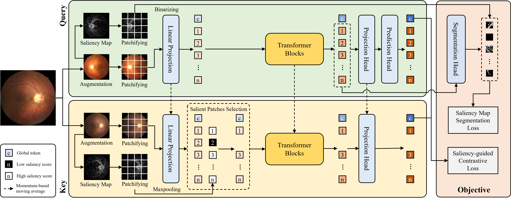

# SSiT: Saliency-guided Self-supervised Image Transformer

This is the pytorch implementation of the paper:

> Y. Huang, J. Lyu, P. Cheng, R. Tam and X. Tang, "SSiT: Saliency-guided Self-supervised Image Transformer for Diabetic Retinopathy Grading", under review, 2022. \[[arxiv](https://arxiv.org/abs/2210.10969)\]




## Dataset
Four publicly accessible datasets are used in this work.

Pretraining:
- EyePACS [[homepage](https://www.kaggle.com/c/diabetic-retinopathy-detection/overview)].

Evalutation:
- DDR [[homepage](https://github.com/nkicsl/DDR-dataset)].
- APTOS 2019 [[homepage](https://www.kaggle.com/c/aptos2019-blindness-detection/overview)].
- Messidor-2 [[images](https://www.adcis.net/en/third-party/messidor2/)] [[labels](https://www.kaggle.com/datasets/google-brain/messidor2-dr-grades)].


## Installation
To install the dependencies, run:
```shell
git clone https://github.com/YijinHuang/SSiT.git
cd SSiT
conda create -n ssit python=3.8.0
conda activate ssit
pip install -r requirements.txt
```


## Usage
### Dataset preparation

1\. Organize each dataset as follows:
```
├── dataset
    ├── train
        ├── class1
            ├── image1.jpg
            ├── image2.jpg
            ├── ...
        ├── class2
            ├── image3.jpg
            ├── image4.jpg
            ├── ...
        ├── class3
        ├── ...
    ├── val
    ├── test
```
Here, `val` and `test` have the same structure of  `train`. Note that we do not use image labels in the pretraining stage, so this folder structure is not required for the pretraining dataset (EyePACS in this work).

2\. Data preprocessing for all datasets (crop and resize):
```shell
cd utils
python crop.py -n 8 --crop-size 512 --image-folder <path/to/image/dataset> --output-folder <path/to/processed/dataset>
cd ..
```
Here, `-n` is the number of workers. The processed dataset will be saved in the `--output-folder`.

3\. Data preprocessing for the **pretraining dataset (EyePACS)** only:

```shell
cd utils
python saliency_detect.py -n 8 --image-folder <path/to/processed/dataset> --output-folder <path/to/saliency/folder>
python folder2pkl.py --image-folder <path/to/processed/dataset> --saliency-folder <path/to/saliency/folder> --output-folder ../data_index/
cd ..
```


### Pretraining
Pretraining with ViT-S on a single multi-GPUs node:
```shell
python main.py \
    --distributed --port 28888 --num-workers 32 \ 
    --arch ViT-S-p16 --batch-size 512 \
    --epochs 300 --warmup-epochs 40 \
    --data-index ./data_index/pretraining_dataset.pkl \
    --save-path <path/to/save/checkpoints> 
```
Specify `CUDA_VISIBLE_DEVICES` to control the number of GPUs. To reproduce the results in the paper, at least 64GB GPU memory is required. (4 NVIDIA RTX 3090 GPUs with 24GB memory are used in our experiments.)


### Evaluation
Fine-tuning evaluation on DDR dataset on one GPU:
```shell
python eval.py \
    --dataset ddr --arch ViT-S-p16 --kappa-prior \
    --data-path <path/to/DDR/dataset/folder> \
    --checkpoint <path/to/pretrained/model/epoch_xxx.pt> \
    --save-path <path/to/save/eval/checkpoints>
```

Linear evaluation on DDR dataset on one GPU:
```shell
python eval.py \
    --dataset ddr --arch ViT-S-p16 --kappa-prior \
    --linear --learning-rate 0.002 --weight-decay 0 \
    --data-path <path/to/DDR/dataset/folder> \
    --checkpoint <path/to/pretrained/model/epoch_xxx.pt> \
    --save-path <path/to/save/eval/checkpoints>
```

Perform kNN-classification on DDR dataset:
```shell
python knn.py \
    --dataset ddr --arch ViT-S-p16 \
    --data-path <path/to/DDR/dataset/folder> \
    --checkpoint <path/to/pretrained/model/epoch_xxx.pt> \
```

Note that the `--checkpoint` should be `epoch_xxx.pt` instead of `checkpoint.pt` in the pretraining save path. To evaluate on other datasets, update `--dataset` to messidor2 or aptos2019 and the `--data-path` to corresponding dataset folder.


### Visualization
To visualize self-attention maps from folder of images:
```shell
cd utils
python attn_visualize.py \
    --arch ViT-S-p16 --image-size 1024 \
    --image-folder <path/to/image/folder/to/visualize> \
    --checkpoint <path/to/pretrained/model/epoch_xxx.pt> \
    --output-dir <path/to/save/visualization>
cd ..
```


## Citation

This paper is under review. If you find this repository useful, please cite the paper:

```
@article{huang2022ssit,
  title={SSiT: Saliency-guided Self-supervised Image Transformer for Diabetic Retinopathy Grading},
  author={Huang, Yijin and Lyu, Junyan and Cheng, Pujin and Tam, Roger and Tang, Xiaoying},
  journal={arXiv preprint arXiv:2210.10969},
  year={2022}
}
```

